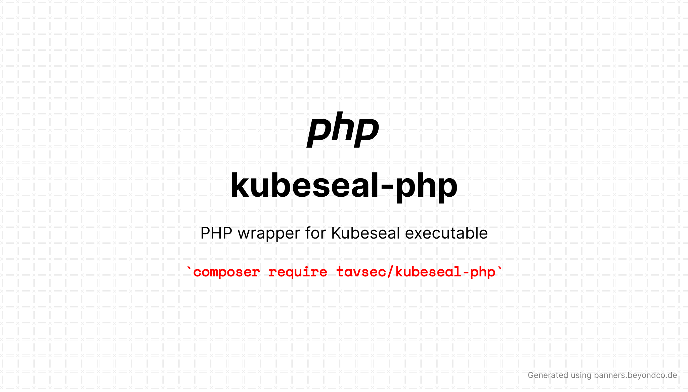

# kubeseal-php
`kubeseal-php` is a PHP wrapper for [sealed-secrets `kubeseal` executable](https://github.com/bitnami-labs/sealed-secrets)
that allows you to encrypt your Kubernetes secrets using a public key in PHP.

<p align="center">
<a href="https://poser.pugx.org/tavsec/kubeseal-php/v/stable"></a>
<a href="https://packagist.org/packages/tavsec/kubeseal-php"></a>
<a href="https://packagist.org/packages/tavsec/kubeseal-php"></a>
</p>

## Requirements

- PHP >= 8.1
- ``kubeseal`` executable
- sealed secrets public key* OR  
- `kubeseal` executable connected to Kubernetes cluster


<i>&ast; public key can be fetched by running `kubeseal --fetch-cert > kubeseal_cert.pem`</i>

## Installation

This package can be installed on any PHP version >= 8.1 using [composer](https://getcomposer.org/).

```bash
composer require tavsec/kubeseal-php
```

## Usage

Currently, `kubeseal-php` supports [raw encryption of secrets](https://github.com/bitnami-labs/sealed-secrets?tab=readme-ov-file#raw-mode-experimental) using `kubeseal` executable. This means that the secret values can be encrypted
one by one, and the resulting encrypted values can be used in Kubernetes (sealed secrets) manifests.

In the future releases we might support encrypting the whole secret at once, using multiple values, and producing the 
full manifest.

All 3 encryption scopes are supported: `strict`, `cluster-wide` and `namespace-wide`.

```php
use Tavsec\KubesealPhp\Kubeseal;

$kubeseal = new Kubeseal();
$kubeseal->setKubesealPath("/usr/bin/kubeseal");

// Required only if you don't have kubeseal connected to Kubernetes cluster
$kubeseal->setCertificatePath("kubeseal_cert.pem");
      
// Encrypt using strict scope
$sealedValue = $kubeseal->encryptRaw(
    data: "my-secret-value", 
    scope: Kubeseal::SCOPE_STRICT, 
    secretName: "secret-name", 
    namespace: "namespace"
);

// Encrypt using namespace-wide scope
$sealedValue = $kubeseal->encryptRaw(
    data: "my-secret-value", 
    scope: Kubeseal::SCOPE_NAMESPACE, 
    namespace: "namespace"
);

// Encrypt using cluster-wide scope
$sealedValue = $kubeseal->encryptRaw(
    data: "my-secret-value", 
    scope: Kubeseal::SCOPE_CLUSTER
);

echo $sealedValue; // #Ag...
        
```
